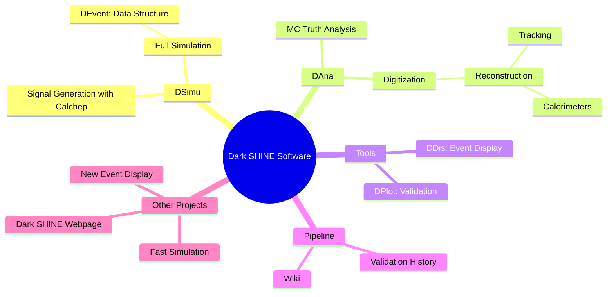
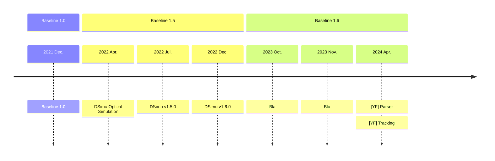

 

 </img>

---
layout: pageBar
hideInToc: true
---

# Outline

 

### <Toc />

---
layout: pageBar
---

# Simulation Framework Overview
 

<Transform :scale="1.0">

</Transform>

---
layout: pageBar
---

# Versions and Milstones

---
layout: pageBar
---

# Version Update Detail

 

## blabla

---
layout: pageBar
---

# Validation and Pipeline

---
layout: pageBar
---

# CPU Performance and Sample Production

Hover on the bottom-left corner to see the navigation's controls panel

## Simulation

## Reconstruction

---
layout: pageBar
---

# Multi-threading for DSimu

 

---
layout: pageBar
---

# Tracking Performance

Two 3D plots for display

Try to interact with the graphs 🥰

<Transform :scale="0.65">
<PlotlyGraph filePath="Graph/plotly2.json" graphWidth="900"/>
</Transform>

<Transform :scale="0.65">
<PlotlyGraph filePath="Graph/plotly3.json" graphWidth="900"/>
</Transform>

---
layout: pageBar
---

# Calorimetry

---
layout: pageBar
---

# Future Plans and Timeline

---
layout: pageBar
---

# Summary

---
layout: center
class: "text-center"
---

# Thanks

[Documentations](https://code.ihep.ac.cn/darkshine/darkshine-simulation/-/wikis/home) / [Git Repo](https://code.ihep.ac.cn/darkshine/darkshine-simulation/-/commits/master)

---
layout: pageBar
---
