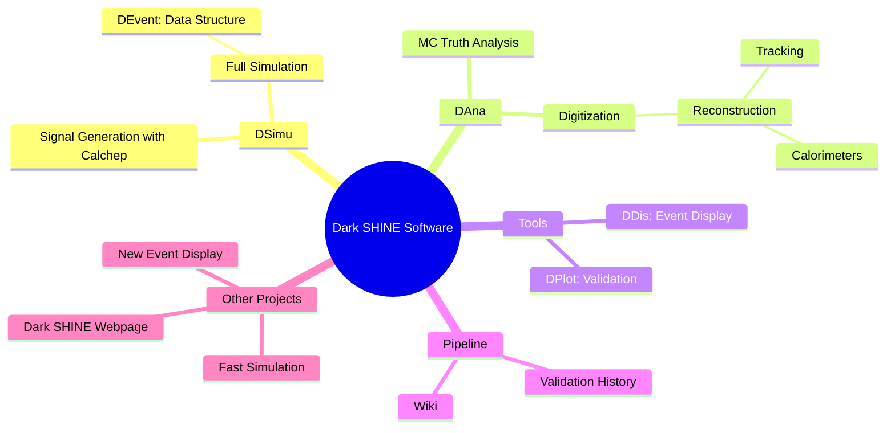
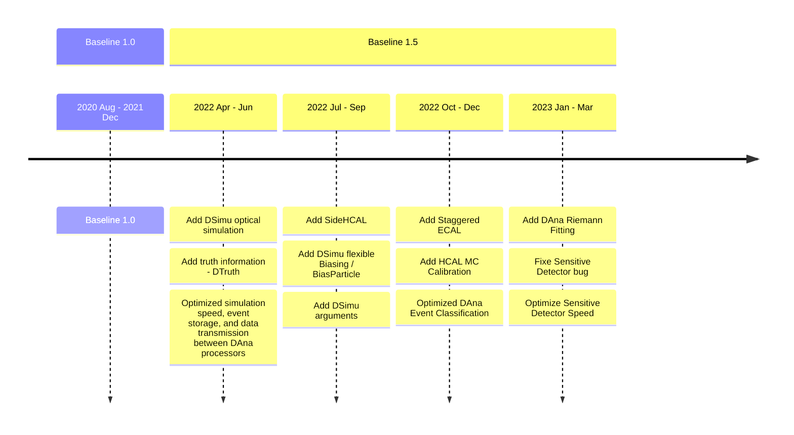
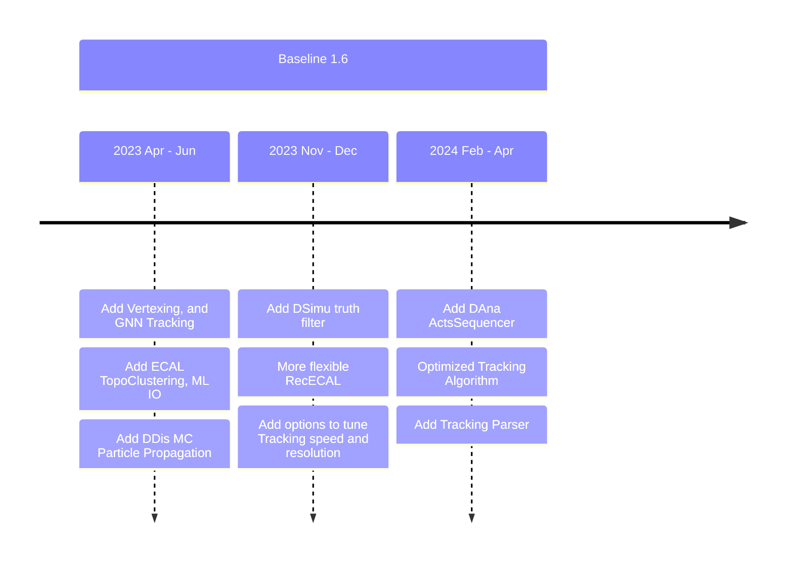

 

 </img>

---
layout: pageBar
hideInToc: true
---

# Outline

 

### <Toc />

---
layout: pageBar
---

# Overview
 

<Transform :scale="1.0">

</Transform>

---
layout: pageBar
---

# Versions and Milstones

<Transform :scale="0.8">

</Transform>

---
layout: pageBar
hideInToc: true
---

# Versions and Milstones

<Transform :scale="0.9">

</Transform>

---
layout: pageBar
---

# Pipeline and Validation

 

Pipeline will be triggered when :
- **Merge request** to master branch
- With keyword `[CI]` or `[VIP]` in the commit message

{width=400px}

Validation plots will be downloadable in the artifacts.

{width=400px}

---
layout: pageBar
---

# CPU Performance and Sample Production

 

## DSimu Simulation

Current Simulation Speed is **x21** faster than Baseline 1.0 (900ms)

{width=500px}

## DAna Reconstruction

  

{width=400px}

---
layout: pageBar
---

# CPU Performance and Sample Production

---
layout: pageBar
---

# Tracking Performance (ActsSequencer)

Tracking Efficiency and Energy Resolution 

<Transform :scale="0.9">

| Efficiency | Inclusive | Signal 5 MeV |
|------------| ---   | --- |
| Tagging | 99.94% | 99.94% |
| Recoil | 99.76% | 80.49 %|

</Transform>

<Transform :scale="0.65">
<PlotlyGraph filePath="/Graph/Acts_TagTrk_P__cut2.json"/>
</Transform>

<Transform :scale="0.65">
<PlotlyGraph filePath="/Graph/Res_dActs_RecTrk_P_1_precut.json"/>
</Transform>

---
layout: pageBar
---

# Calorimetry
 

## ECAL Smearing method
The smearing of ECAL is done in reconstruction/analysis level. For each ECAL cell, the energy of hits are summed, then Gaussian function is used to do the smearing, with the mean value set to truth energy and sigma from the formula $\frac{\sigma}{E}=\frac{A}{\sqrt{E}}+B+\frac{C}{E}$ . The A B C parameters are extracted from standalone simulation with optical process enabled.

## Smearing parameter used in analysis

|                     | $A\sqrt{MeV}$ |     $A\sqrt{GeV}$    |       $B$      |      $C/MeV$     |
|:-------------------:|:-------------:|:-----------------:|:------------:|:----------------:|
|       R90_LYSO      |    31.62%     |        1.00%      |     0.00%    |     0.0000       |
|       R10_LYSO      |    211.69%    |        6.69%      |     0.00%    |     0.0851       |
|      R90_S9_PWO4    |    134.56%    |        4.26%      |     0.70%    |     0.0001       |
|     R90_S36_PWO4    |    73.32%     |        2.32%      |     0.17%    |     0.7051       |

**Detailed plots: set1**

{width=500px}

---
layout: pageBar
---

# Future Plans and Timeline

---
layout: pageBar
---

# Summary

---
layout: center
class: "text-center"
hideInToc: true
---

# Thanks

[Documentations](https://code.ihep.ac.cn/darkshine/darkshine-simulation/-/wikis/home) / [Git Repo](https://code.ihep.ac.cn/darkshine/darkshine-simulation/-/commits/master)

---
layout: pageBar
---
