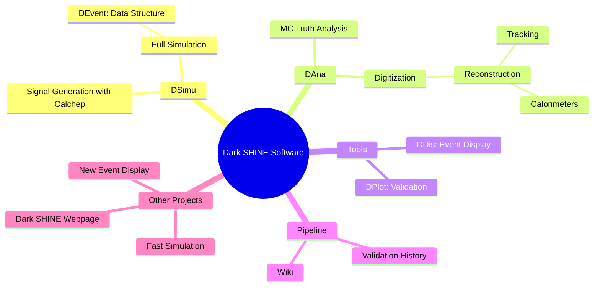
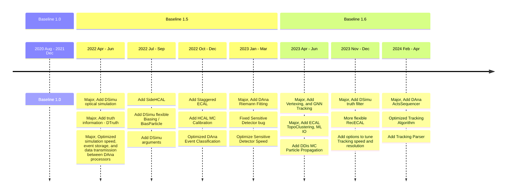
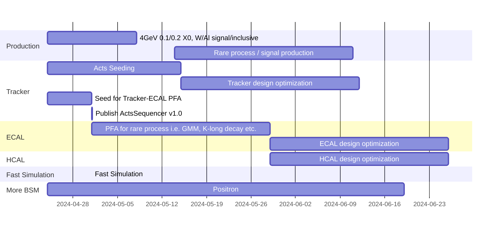

 

 </img>

---
layout: pageBar
hideInToc: true
---

# Outline

 

### <Toc />

---
layout: pageBar
---

# Overview

DarkSHINE Software is a software package, including five parts: **DSimu**, **DAna**, **DDis**, and **DPlot**.

- **DSimu** is the **simulation program** based on Geant4, characterized by Dark SHINE detector, controlled by **yaml configuration**.
- **DAna** is a **framework for the analysis and reconstruction tools**. It requires the output ROOT file (involving Geometry, DMagnet and DEvent) from DSimu.
- **DDis** is the **event display** for DSS. (requires Geometry and DEvent)
- **DPlot** is a quick plotting program for newbies and lazy man.
- **DEvent** is the **generic data structure** in DSS.

<Transform :scale="1.0">

</Transform>

---
layout: pageBar
---

# From Baseline 1.0 to 1.6: Detector Construction

Detector Construction Overview

{width=600px}

{width=400px}

  

---
layout: pageBar
hideInToc: true
---

# From Baseline 1.0 to 1.6: Detector Construction

Tracking System

Baseline 1.6 Tracker uses **Si micro-strip** ( $30 \mathrm{\mu m}$ ) and **non-uniform magnetic field**, while Baseline 1.0 uses non-strip (truth hit) and uniform magnetic field.

| Baseline |                                                  | Magnetic Field                                  | Component                                              | Material                | Center Z (mm)                                   | Size (mm)                                                                                                                                      | Layer Number           |
|----------|--------------------------------------------------|-------------------------------------------------|--------------------------------------------------------|-------------------------|-------------------------------------------------|------------------------------------------------------------------------------------------------------------------------------------------------|---------------------------|
| 1.0      | {width=100px} | $B_y=-1.5 \mathrm{T}$                  | Tagging Tracker   Target   Recoil Tracker  | Si   W   Si | -607.83 ~ -7.83   0   7.73 ~ 180.23 | 100, 200, 0.1   100, 200, 0.35   100~250, 200, 0.1                                                                                 | 7x2   1   6x2 |
| 1.6      | {width=100px} | {width=200px} | Tagging Tracker   Target   Recoil Tracker  | Si   W   Si | -607.83 ~ -7.83   0   7.73 ~ 180.23 | 201, 100, **0.15**   200, 100, 0.35   201~501, 200, **0.15** | 7x2   1   6x2 |

---
layout: pageBar
hideInToc: true
---

# From Baseline 1.0 to 1.6: Detector Construction

ECAL

| Baseline |                                               | Configuration                                    | Cell Number                                       | Cell Gap | Gap Material | Cell Components                | Material                                               | Size (cm)                                      |
|----------|-----------------------------------------------|--------------------------------------------------|---------------------------------------------------|----------|-----------------|--------------------------------|--------------------------------------------------------|------------------------------------------------|
| 1.0      | {width=100px} | Cubic                                            | 20, 20, 11                                        | 0.1 mm   | CarbonFiber     | Wrapper APD Scintillator | Al Si LYSO                                       | 2.53, 2.53, 4.13 1, 1, 0.1 2.5, 2.5, 4.0 |
| 1.6      | {width=120px} | **Staggered** | **21, 21**, 11 | 0.1 mm   | CarbonFiber     | Wrapper APD Scintillator | **C** Si LYSO | 2.53, 2.53, 4.13 1, 1, 0.1 2.5, 2.5, 4.0 |

---
layout: pageBar
hideInToc: true
---

# From Baseline 1.0 to 1.6: Detector Construction

HCAL

In Baseline 1.6, The Design of HCAL is optimized. SideHCAL is added around the 4 sides of ECAL.

| Baseline |                                               | Configuration                                  | Cell Gap                                      | Module Gap | Gap Material | Cell Components                                                                              | Material                                                                             | Size (cm)                                                                                                          |
|----------|-----------------------------------------------|------------------------------------------------|-----------------------------------------------|------------|-----------------|----------------------------------------------------------------------------------------------|--------------------------------------------------------------------------------------|--------------------------------------------------------------------------------------------------------------------|
| 1.0      | {width=200px} | XY-Abs-XY                                      | 0                                             | 0.5 mm     | CarbonFiber     | Wrapper APD Scintillator                                                               | Al Si Polystyrene                                                              | 1.03, 5.03, 100.7 0.3, 0.3, 0.1 1, 5, 100.57                                                                 |
| 1.6      | {width=150px} | **X-Abs-Y** | **0.1 mm** | 0.5 mm     | CarbonFiber     | Wrapper APD Scintillator **Fiber Clad Fiber** | **C** Si Polystyrene Polystyrene PMMA | 1.03, 5.03, **75.55** 0.3, 0.3, 0.1 1, 5, 75.42 r=1.2 mm r=1.176 mm |

---
layout: pageBar
---

# From Baseline 1.0 to 1.6: Versions and Milstones

Many functions and optimizations have been added to the software since 2020.

---
layout: pageBar
---

# CI/CD Pipeline and Validation

 

Pipeline to build and draw **validation plots** will be triggered in each commit to **master** branch.
- Or with keyword `[CI]` or `[VIP]` in the commit message

{width=400px}

- Validation plots in the pipeline artifacts, and can be posted on wiki.

{width=400px}

---
layout: pageBar
---

# CPU Performance and Event Storage

 

## DSimu (Simulation)

Current Simulation Speed is **x21** faster than Baseline 1.0 (900ms)

{width=500px}

Storage: 60KB / event $\to$ 14 KB / event

## DAna (Reconstruction)

~9ms per event

{width=400px}

---
layout: pageBar
---

# Sample Production

 

{width=1100px}

---
layout: pageBar
---

# Tracking

 

**Dark SHINE Tracking Package:**
- Track Finding
  - **Greedy algorithm**
  - Future ML method
- Fitting
  - Kalman filter
  - **Riemann filter**
- Output
  - Seed for Tracker-ECAL PFA
  - Vertex for visible decay
  - ...

**Acts Sequencer:**
- SeedingAlgorithm
  - Default Seeding
  - Truth Seeding
- Track Finding & Fitting
    - **CombinatorialKalmanFilter**
- Output
  - Vertex for visible decay
  - Seed for Tracker-ECAL PFA \[WIP\]

---
layout: pageBar
hideInToc: true
---

# Tracking

Filter Efficiency and Resolution (Truth Seeding)

<Transform :scale="0.9">

| Efficiency | Inclusive | Signal 5 MeV |
|------------| ---   | --- |
| Tagging | 99.94% | 99.94% |
| Recoil | 99.76% | 80.49 %|

</Transform>

<Transform :scale="0.65">
<PlotlyGraph filePath="https://darkshine-analysis-ykrsama-1c4398ed5549bed87b570e88b7efabc7603d.gitlab.io/actsSequencerV03/plot/json/Res_dActs_RecTrk_P_1_precut.json"/>
</Transform>

<Transform :scale="0.65">
<PlotlyGraph filePath="https://darkshine-analysis-ykrsama-1c4398ed5549bed87b570e88b7efabc7603d.gitlab.io/actsSequencerV03/plot/json/Res_dActs_RecTrk_P_1_precut.json"/>
</Transform>

---
layout: pageBar
---

# Calorimetry
(For ECAL Clustering etc., see Qibin & Zhiyu's Talk)

## ECAL Smearing method
The smearing of ECAL is done in reconstruction/analysis level. For each ECAL cell, the energy of hits are summed, then Gaussian function is used to do the smearing, with the mean value set to truth energy and sigma from the formula $\frac{\sigma}{E}=\frac{A}{\sqrt{E}}+B+\frac{C}{E}$ . The A B C parameters are extracted from standalone simulation with optical process enabled.

## Smearing parameter used in analysis

<Transform :scale="0.9">
 

|                     | $A\sqrt{MeV}$ |     $A\sqrt{GeV}$    |       $B$      |      $C/MeV$     |
|:-------------------:|:-------------:|:-----------------:|:------------:|:----------------:|
|       R90_LYSO      |    31.62%     |        1.00%      |     0.00%    |     0.0000       |
|       R10_LYSO      |    211.69%    |        6.69%      |     0.00%    |     0.0851       |
|      R90_S9_PWO4    |    134.56%    |        4.26%      |     0.70%    |     0.0001       |
|     R90_S36_PWO4    |    73.32%     |        2.32%      |     0.17%    |     0.7051       |

</Transform>

**Detailed plots: set1**

{width=400px}

---
layout: pageBar
---

# Future Plans and Timeline

<Transform :scale="1.2">

</Transform>

---
layout: center
class: "text-center"
hideInToc: true
---

# Thanks

[Documentations](https://code.ihep.ac.cn/darkshine/darkshine-simulation/-/wikis/home) / [Git Repo](https://code.ihep.ac.cn/darkshine/darkshine-simulation/-/commits/master)

---
layout: pageBar
---
